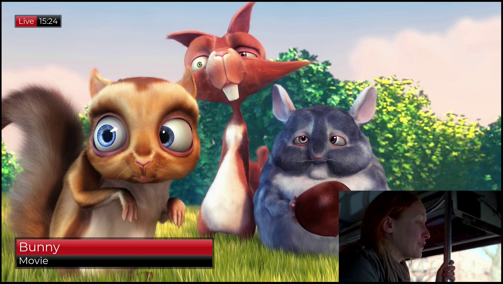

# Multiple Video sources with overlay on DRM

This is an example reading two camera inputs and displaying it as a picture-in-picture on the direct video output without X11/Wayland.

The project consists of three docker containers (all based on debian:bookworm)
### endless-stream-server
Decodes two video files an streams them to /dev/video10 and /dev/video11 [see](endless-stream/Readme.md) to see how this is setup.

### overlay-server
A simple http server which acts as input for the demo-app to grab an HTML page. Can be managed via: http://localhost:3000/admin

The actual overlay server was implemented by https://github.com/moschopsuk/Roses-2015-CasparCG-Graphics with some adaption from [here](https://github.com/Igalia/wpe-graphics-overlays/tree/1e23f781adef05d6d2f291d9bb67c28f9bb9b2f1).
It gives a nice http frontend to dynamically create overlays. In this sample it is reachable at http://localhost:3000/.


### demo-app
Takes the input from /dev/video10 and /dev/video11, combines them and sends them to the HDMI display.

The gstreamer pipeline
```bash
gst-launch-1.0 \
  glvideomixer name=mixer_overlay sink_0::zorder=1 sink_1::zorder=0 sink_0::alpha=1.0 sink_1::alpha=1.0 ! gldownload ! videoconvert ! kmssink connector-id=77 \
  wpesrc location="http://<url-of-overlay-server>:3000" name=wpesrc draw-background=0 ! queue ! mixer_overlay. \
  glvideomixer sink_0::zorder=0 sink_1::zorder=1 sink_1::xpos=1296 sink_1::ypos=728 name=m ! queue ! mixer_overlay. \
  v4l2src device=/dev/video10 ! queue ! videoconvert ! glupload ! queue ! m.sink_0 \
  v4l2src device=/dev/video11 ! videoconvert ! glupload \
  ! gltransformation scale-y=1.0 scale-x=1.0 \
  ! queue ! m.sink_1
```

Output with configured overlay



## Usage
Build the docker files 

start the input container:
run `task endless-stream-server`

start the overlay server:
run `task overlay-server`

start the actual application:
run `task run-docker`